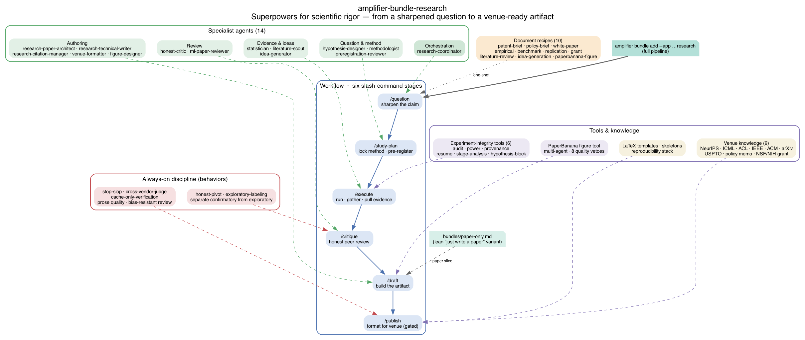

# amplifier-bundle-research

**Superpowers for scientific rigor — for anyone who needs a defensible written artifact.**

Patent briefs. Policy positions. White papers. Literature reviews. Workshop papers. Grant applications. Full journal articles. Same discipline, same scaffolding, output shaped to the venue.

---


## v0.8.0 (2026-04-30) — Audit-closure release

Closes the gap list from the v0.7-era external audit. Adds the orchestrated-loop recipe (the H3 enabler from the program paper), four new agents gene-transferred from `amplifier-bundle-scientificpaper` and `AI-Scientist`, two new behaviors, one new awareness context, and a healthcheck script. See `docs/V0.8.0-PLAN.md` for the durable record and `scripts/v0.8.0-healthcheck.sh` for one-command verification.

Headline additions:
- `recipes/orchestrated-loop.yaml` — Phase 1 → Phase 2 → reconfigure → re-run, with residual-ledger schema, blinded adjudication, and no-op drift baseline (canonical reference: `attractor.yaml` Stage 3).
- `agents/paper-architect.md` — structural-planning agent (IMRAD, abstract framework, section budgets, paper-type templates). Transferred from `amplifier-bundle-scientificpaper`.
- `agents/ml-paper-reviewer.md` — venue-calibrated peer-review feedback (NeurIPS/ICML/ICLR/ACL/CVPR rubric + 5-ensemble + meta-reviewer + mandatory calibration warning).
- `agents/literature-scout.md` — agentic Semantic Scholar novelty-search loop.
- `agents/idea-generator.md` + `recipes/idea-generation.yaml` — autonomous research ideation with 3-axis Interestingness × Feasibility × Novelty scoring + reflection convergence + archive injection.
- `behaviors/cache-only-verification.md` + `recipes/cache-only-verify.yaml` — committee-audit re-verification path (`--from-cache` mode) without API keys.
- `behaviors/cross-vendor-judge.md` — codifies cross-vendor LLM-judge enforcement to mitigate the v3 program paper's reflexivity-hazard #1.
- `context/experiment-calibration-awareness.md` — ECE / Brier / reliability-diagram as first-class metrics.
- `scripts/v0.8.0-healthcheck.sh` — 43-check structural + capability + wire-up healthcheck. All passing.

All gene-transfers are idea-level. AI-Scientist's GPU experiment runner, aider dependency, and NPEET are intentionally NOT imported.

## Install (once)

```bash
amplifier bundle add --app git+https://github.com/michaeljabbour/amplifier-bundle-research@main
amplifier bundle use research
amplifier
```

That's it. No YAML edits, no API keys beyond the one Amplifier already has.

## Use it — slash commands

```text
> /question
  What claim are you trying to defend?

> /study-plan
  Locks your methodology before you see results. Writes a hash-sealed
  pre-registration. (Named /study-plan because the generic /plan slash
  command is reserved by amplifier-bundle-modes — the research-coordinator
  routes natural-language "plan" requests here regardless.)

> /execute
  Runs the analysis, gathers prior art, or pulls the evidence — depending on
  what you're making.

> /critique
  An honest peer reviewer on your work. Names specific limitations. Flags
  overclaiming. Separates confirmatory from exploratory.

> /draft
  Produces the artifact in the right structure for the audience.

> /publish
  Formats for the target venue. LaTeX, DOCX, or plain brief. Blocks until
  critique has run and any honest-pivots have been acknowledged.
```

## Or skip straight to a recipe

Natural-language invocation (research-coordinator routes to the right recipe):

```bash
amplifier run "Run the patent-brief recipe on: Novel rolling-ROI control for AI agent sessions"
amplifier run "Run the policy-brief recipe on: Municipal guidance on generative AI in K-12"
amplifier run "Run the white-paper recipe on: Return on Inference — when model spend pays back"
amplifier run "Run the empirical-paper recipe on: Reflection tokens improve long-horizon reasoning"
amplifier run "Run the replication-study recipe on: Reproducing X et al. 2025 on dataset Y"
amplifier run "Run the benchmark-paper recipe on: RCE — Reasoning Chain Evaluation benchmark"
amplifier run "Run the grant-proposal recipe on: NSF CAREER — Inference-time compute allocation"
amplifier run "Run the literature-review recipe on: Systematic review of chain-of-thought methods"
```

Or direct tool invocation:

```bash
amplifier tool invoke recipes operation=execute \
  recipe_path=@research:recipes/patent-brief.yaml \
  'context={"invention": "Novel rolling-ROI control for AI agent sessions"}'
```

## Why this exists

Scientific rigor is a set of habits: ask a precise question, lock the method before you see the data, report honestly against yourself, cite properly, format for the reader. Working researchers learn these over a decade. Everyone else reinvents the mistakes.

This bundle encodes the habits. A patent attorney, a policy analyst, a founder drafting a technical white paper, or a junior researcher drafting their first workshop paper — all get the same scaffolding and the same honest critic, shaped to what they're making.

## What's inside

Thin wrappers over [K-Dense scientific-agent-skills](https://github.com/K-Dense-AI/scientific-agent-skills), orchestrated with a [Superpowers](https://github.com/microsoft/amplifier-bundle-superpowers)-style mode workflow, informed by [Denario](https://github.com/AstroPilot-AI/Denario)'s multi-agent topology, packaged for the install ease of [amplifier-bundle-stories](https://github.com/michaeljabbour/amplifier-bundle-stories).

See [`docs/SPEC.md`](docs/SPEC.md) for the full specification.

### v0.2.0 inventory

- **10 agents** — hypothesis-designer, preregistration-reviewer, methodologist, statistician, honest-critic, technical-writer, figure-designer, citation-manager, venue-formatter, research-coordinator
- **6 runtime modes** — `/question`, `/study-plan`, `/execute`, `/critique`, `/draft`, `/publish` (register as slash commands via `amplifier-bundle-modes`)
- **9 recipes** — patent-brief, policy-brief, white-paper, empirical-paper, benchmark-paper, replication-study, grant-proposal, literature-review, paperbanana-figure
- **7 behaviors** — honest-pivot, exploratory-labeling, paperbanana, figure-generation, latex-authoring, conference-styling, research-modes (composite in `behaviors/research.md`)
- **6 conference formats + 3 non-academic venues** — NeurIPS, ICML, ACL, IEEE, ACM, arXiv + USPTO patent, policy memo, NSF/NIH grant
- **Reproducibility stack** — `environment.yml`, `requirements.in`, `Dockerfile.research`, `execution-log.yaml` schema, `evidence-log.yaml` schema for evidence-gather recipes
- **LaTeX templates** — ACL and IEEE style files, IMRAD skeleton, patent-brief + policy-brief + white-paper + grant + replication-study markdown skeletons
- **PaperBanana** — multi-agent figure generation with 8 quality veto rules (Python module at `modules/tool-paperbanana/`)
- **Utility scripts** — LaTeX compilation, format validation, figure generation, template download

## Architecture



Generated via `amplifier tool invoke recipes operation=execute recipe_path=@foundation:recipes/generate-bundle-docs.yaml`. Regenerate on structural changes (`validate-bundle-repo` does this automatically when `source_hash` drifts).

## Samples

End-to-end runs of the pipeline, preserved as repo artifacts with session YAMLs, final PDFs, and capability catalogs. Browse the index at [`docs/SAMPLES.md`](docs/SAMPLES.md). First entry: [`examples/whitepaper-dogfood-run/`](examples/whitepaper-dogfood-run/) — a 16-page LaTeX white paper on the bundle itself, written with the bundle, for a patent-attorney audience.

## Local development

To exercise the bundle from a local checkout without publishing, clone and register the working tree:

```bash
git clone https://github.com/michaeljabbour/amplifier-bundle-research.git
cd amplifier-bundle-research

# Register the local working tree as a named bundle
amplifier bundle add "file://$(pwd)" --name research-dev

# Run against it
amplifier run --bundle research-dev --mode chat "your prompt here"

# After local changes, refresh:
amplifier bundle remove research-dev && \
  amplifier bundle add "file://$(pwd)" --name research-dev
```

See [`bundles/dev.yaml`](bundles/dev.yaml) for the standalone composition and [`docs/HANDOFF.md`](docs/HANDOFF.md) for the full development workflow.

## Status

`v0.2.0` — fully specified, implemented, and Amplifier-hygienic. All agents, modes, recipes, behaviors, reproducibility templates, and three non-academic venue formats are written. `bundle.md` is in valid frontmatter form; agents carry proper `meta:` blocks with `model_role`; `tool-paperbanana` is protocol-compliant; modes register as slash commands; critique-required and honest-pivot-acknowledged gates enforce at `/publish`.

See [`docs/HANDOFF.md`](docs/HANDOFF.md) for what's verified, what's not yet been tested end-to-end, and the v0.4+ roadmap (user testing across three personas, dogfood paper, domain packs).

## License

MIT. Credits and lineage in [`docs/LINEAGE.md`](docs/LINEAGE.md).

## See also: amplifier-bundle-scientificpaper

This bundle is the broader research-lifecycle substrate (`/question` → `/study-plan` → `/execute` → `/critique` → `/draft` → `/publish`, with hypothesis sharpening, methodology lockdown, statistical tooling, and reproducibility infrastructure). It is the right choice for any researcher writing a defensible artifact end-to-end.

If you only want the paper-authoring slice — no modes, no pre-registration, no statistical machinery, just LaTeX/conferences/figures/citations — install [amplifier-bundle-scientificpaper](https://github.com/michaeljabbour/amplifier-bundle-scientificpaper) instead. It has a coherent independent purpose: the clean no-modes-required interface for "I just want to write a paper."

The two bundles share substantial infrastructure (Python scripts, conference formats, LaTeX templates, PaperBanana figure-generation module, paper-authoring behaviors) but differ in scope: research includes the full research-lifecycle pipeline (idea generation, novelty checking, peer-review feedback, statistical validation, the orchestrated H3 loop); scientificpaper covers only paper authoring. Detailed inventory + gene-transfer history in `docs/V0.8.0-PLAN.md`.

